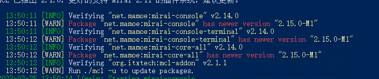

# 简略版

1. 安装bukkit插件,和其它插件一样放进plugins文件夹即可,可以使用插件直接进行热加载,但不建议
2. 在群中下载带\[win一键包]字样的压缩包,如果是其它系统下载\[含Mirai框架无java]
3. 解压压缩包,运行mcl.cmd或mcl.sh(根据系统自行选择)启动Mirai控制台
4. Mirai控制台启动后,在控制台输入**/autologin add qq账号 密码**配置自动登录
5. 输入stop然后重新打开mirai,继续完成登录步骤
6. 如没有报错Mirai端配置完成
7. 在指定群启用消息同步(二选一)
   * ①在群里输入/chatsync bind this(注意需要管理员及以上权限)
   *

       <figure><figcaption></figcaption></figure>
   * ②在Mriai控制台执行/chatsync groupid \[群id]
8. 如果服务器和Mriai在同一服务器此时你应该已经完成了绑定,可以进行消息同步了
9. 如果Mriai和服务器不再同一局域网,修改服务器(bukkit)端chatsync插件配置文件, 将ip内容更改为Mriai所在ip,完成后重载插件或重启服务器
10. _**Finnish**_

### 图片支持

<figure><figcaption></figcaption></figure>

1. 添加此功能非常简单,只需要在客户端中安装对应版本的mod即可
2. 如果需要发送图片,需要先复制图片到剪贴板,然后调出聊天框,按下Ctrl+V即可


PS:1.12.2版本需要添加Mixin依赖,请自行确认是否需要添加加载mixin的mod如MixinBootstrap

